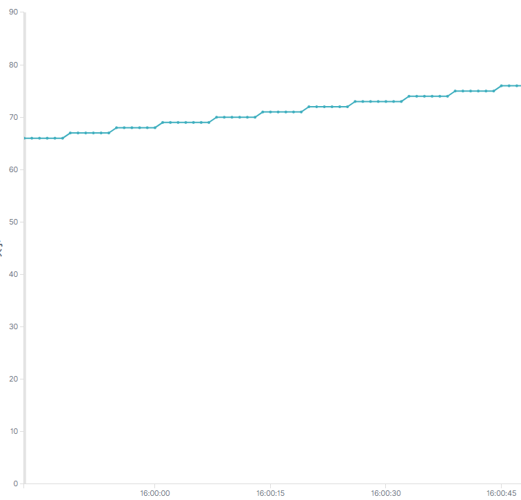
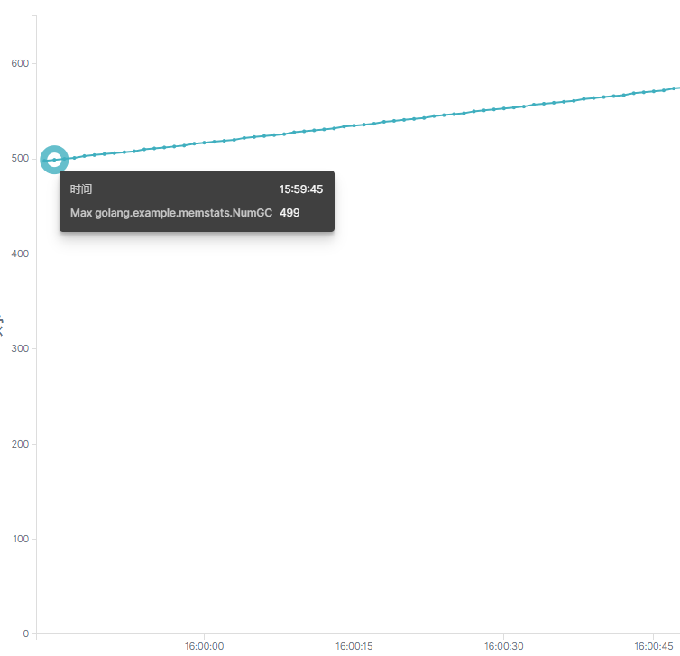
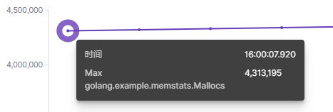
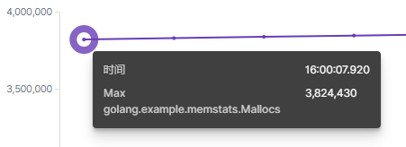

# package cache

package cache is bytes/interface cache manager.

Usage:

```golang
import "github.com/infavor/gox/cache"
// apply cache
bc := cache.ApplyBytes(bufferSize, false)
// recache
defer cache.ReCacheBytes(bc)
// use cache...
```

### 性能测试对比
测试用例参考：[https://github.com/infavor/golib-test/blob/master/src/http_upload_server.go](https://github.com/infavor/golib-test/blob/master/src/http_upload_server.go)

|              | 使用cache                   | 不使用cache                 |
| ------------ | --------------------------- | --------------------------- |
| 代码分支     | master                      | old_http                    |
| NumGC        |  |  |
| Mallocs      |  |  |
| TotalAlloc   | 500,928,176                 | 3,686,271,360               |
| PauseTotalNs | 25,549,814                  | 141,964,319                 |
| PauseNs      | 3,003,165                   | 14,152,667                  |

